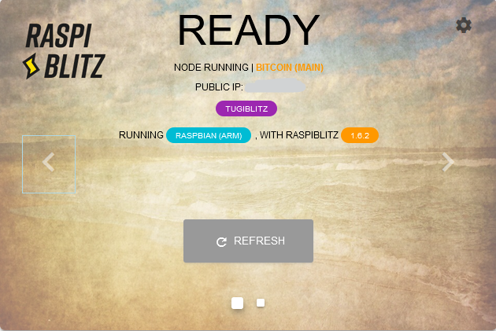

<p align="center">

</p>

## About the Slider

This app is a Laravel-based project offered as optional service in the Raspiblitz. The purpose of the Slider is to show a carousel of slides in the Raspiblitz LCD leveraging a more familiar looking 
At this moment, the Slider offers the following functionality:

- One slide with basic Raspiblitz's status information.
- Another slide with Bitcoin current price.
- A settings page to modify the Bitcoin-related slide.

This is a very early version of a bigger product that I had in mind, but due to time constraints, I decided to make it available already for anyone to play with and/or improve.


## How to install and run it

The current version is not yet fully integrated in the menu of Raspiblitz, but you can install and uninstall it very easily.

Download this file
https://github.com/raulcano/raspiblitz/blob/slider/home.admin/config.scripts/bonus.slider.sh and copy it into your Raspiblitz, in this directory:
```
/home/admin/config.scripts/
```

Once the file is copied, go to the Raspiblizt command line and type this command:
```
./config.scripts/bonus.slider.sh on
```

This will install all dependencies needed and download this app into your Raspiblitz. If all is good, after a couple of minutes you will see the slider in your LCD without further interaction of yours.

In order to stop the slider, type this into the command line:
```
./config.scripts/bonus.slider.sh off
```
### Serving the app to your computer [optional]
When the app has been enabled with the 'on' flag, it runs a simple php server in the Raspiblitz localhost and in the default port 8000. 
This means that you can also access the slider screen and interact with it with from your regular workstation (presumably from where you are accessing to your Raspiblitz). In particular, if you tunnel the ports appropriately, you can access the slider like this:

http://127.0.0.1:8000/#/carousel

## Adding your own functionality [optional]

The most basic functionality has been programmed so a carousel of 2 slides is displayed in the Raspiblitz's LCD.  
Anyone can add their own slides with a bit of knowledge of Laravel and Vue.

To add new functionality, 
- Add a new Vue component with your slide in the folder ```resources/js/views/components```. E.g. ```resources/js/views/components/MyslideSlide.vue```
- Import your component and add the necessary slide code in the file ```resources/js/views/IndexCarousel.vue```

## Work needed

The following issues are the immediate priority:
- Allow the slides to react to the touchscreen.
- Refresh the bitcoin prices automatically every X seconds
- Integrate the app installation script in the Raspiblitz menu
- Many other optimizations and improvements (e.g. run the php server as a Linux service, maybe?)

## License

The Slider is open-sourced software licensed under the [MIT license](https://opensource.org/licenses/MIT).
